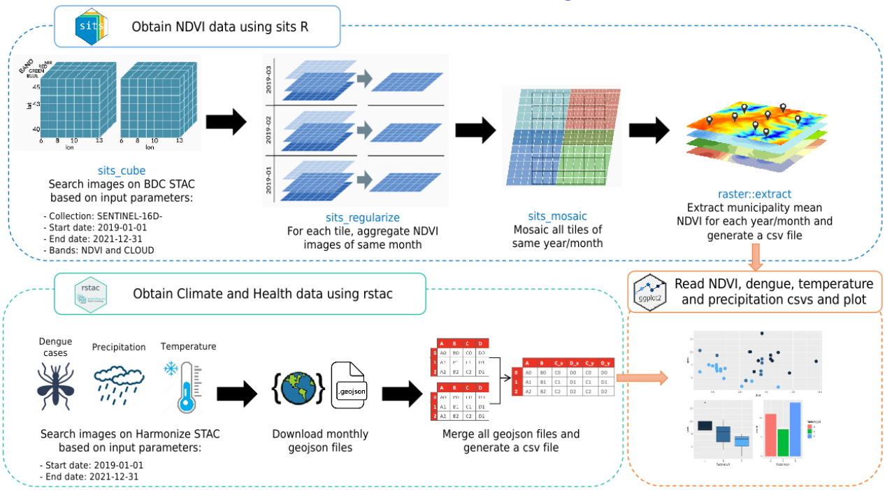
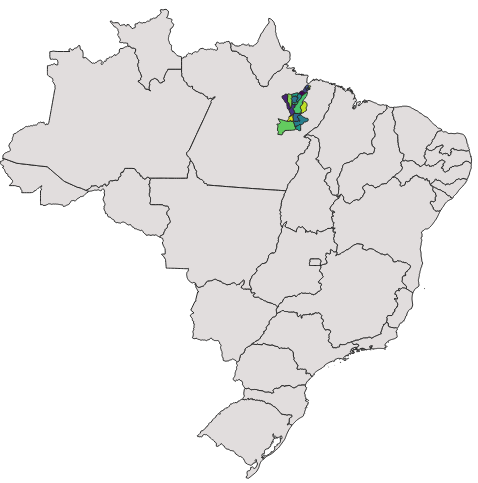

<h2 align="center">
  EODCtHRS Demostration - 2024 Harmonize Annual Meeting
</h2>

<h4 align="center">This repository contains Jupyter notebooks demonstrating some collections and technologies developed by EODCtHRS. Here you can find codes that access the collections generated by Harmonize Brazil and group monthly and weekly NDVI, dengue cases, rainfall and temperature data.</h5>

  
  
  

  
  • <a href="#methodology">Methodology</a> &nbsp;
  • <a href="#roi-region-of-interest">ROI (Region of Interest)</a> &nbsp;
  • <a href="#jupyter-notebooks">Jupyter Notebooks</a> &nbsp;

## Methodology

<h1 align="center">
  
</h1>

## ROI (Region of Interest)

The ROI includes 21 municipalities in the Lower Tocantins Hotspot and is shown in the image below.

<h1 align="center">
  
</h1>

## Jupyter Notebooks

There are 3 main codes in this repository:

- **1. Compute Health and Climate data:** This code uses RSTAC client to search health or climate collections on Harmonize STAC between start and end dates and merge all data in a single dataframe.
- **2. Compute NDVI data:** This code uses sits R package to search for Sentinel 2 NDVI data on BDC STAC between start and end dates, aggregate data monthly, mosaic tiles of same month and compute municipality mean for each month in a single dataframe.
- **3. Plot health, climate and ndvi csvs:** This code opens precipitation, temperature, dengue and ndvi csvs and plot all monthly data in scatter plots.
